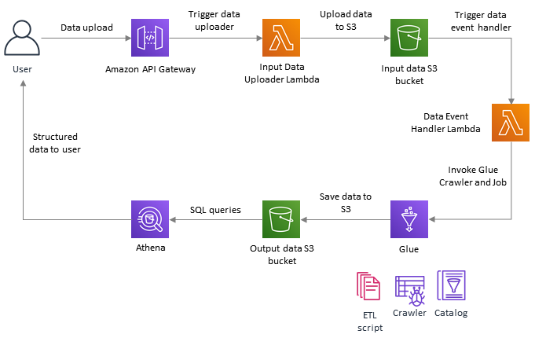

# Extract-Transform-Load Using AWS Glue
This solution is a reference architecture for serverless processing of unstructured data using AWS Glue. The primary objective is to demonstrate how to discover structure (fields) in unstructured data, transform it as per business requirements and present it back to the user using SQL queries. It is based on a sample [solution](https://aws.amazon.com/blogs/database/how-to-extract-transform-and-load-data-for-analytic-processing-using-aws-glue-part-2/) proposed by AWS.
   
 

## Solution Components
The CloudFormation template contains the following:
1. A REST API provided by AWS API Gateway using which user can upload unstructured data for processing. Supported formats include JSON, CSV and [many more](https://docs.aws.amazon.com/glue/latest/dg/add-classifier.html)
2. An uploader lambda function which saves the input data to an S3 bucket
3. An event handler lambda which triggeres AWS Glue service to process the new data
4. AWS Glue Crawler which scans the data, identifies its structure (fields) and updates tables in the database (Data Catalog)
5. AWS Glue Job python script which transforms the data and saves it in S3 bucket in parquet format
6. An S3 bucket which is created by the CloudFormation stack. This bucket stores input and output data
7. An AWS Custom Resource which ensures that the S3 data bucket is empty when the CloudFormation stack is deleted

## Input Parameters
The Cloudformation template requires the following inputs:
1. *dataBucketName*: Name of the new S3 bucket which will be created as part of CloudFormation stack. It will store input and output data
2. *inputDataFolderName*: Folder name where input data should be stored
3. *outputDataFolderName*: Folder name where output data should be stored
4. *tempDataFolderName*: Folder name where temp data should be stored
5. *etlScriptPath*: Path of the ETL script in S3 bucket. For example: `s3://<bucket-name>/glue-etl-transform.py`
6. *databaseName*: The database name where metadata will be stored
7. *lambdaS3BucketName*: S3 bucket name where lambda code resides
8. *inputDataUploaderLambdaZipFilename*: Input data uploader lambda code zipfile name
9. *inputDataUploaderLambdaHandler*: Input data uploader lambda entry point name
10. *eventHanderLambdaZipFilename*: Event handler lambda code zipfile name
11. *eventHandlerLambdaHandler*: Event handler lambda entry point name
12. *customResLambdaZipFilename*: Custom resource lambda code zipfile name
13. *customResLambdaHandler*: Custom resource lambda entry point name

## Glue Job ETL Script
The python script performs the following transformations to the input data:
1. Remove any duplicate records
2. Convert all column names to lowercase
3. Convert data into parquet format and save it to S3 bucket

## Instructions
1. Deploy the CloudFormation template in AWS
2. Note the API Endpoint URL generated in `Outputs` tab of CloudFormation Stack
3. Convert an input document into base64 format
4. Use a tool like Postman to invoke the REST API by providing the following data:
`{
	"docname": "inputDocName",
	"docdata": "<base64 data>"
}`
5. The document will be saved in the new S3 bucket and Glue service will be invoked
6. Open the [AWS Glue console](https://console.aws.amazon.com/glue/home) and verify that the Glue Job has completed. The output data in parquet format will be stored in the S3 bucket
7. Finally, to view the output data via SQL queries, use [AWS Athena](https://docs.aws.amazon.com/athena/latest/ug/getting-started.html) service

## Cleanup
1. Delete the CloudFormation stack
2. Delete the Glue database (Data Catalog)
3. Delete the Athena database

## Known Limitations and Future Improvements
1. The `commonRole` IAM role has multiple permissions merged into one. This can be avoided by using AWS [Serverless Application Model](https://aws.amazon.com/serverless/sam/)
2. During CloudFormation stack teardown, due to timing issues, sometimes the Custom Resource does not delete the contents of the S3 bucket. This can be fixed by adding appropriate dependencies (CloudFormation `DependsOn` attribute)
3. In the current architecture, the table name created by AWS Glue Crawler is not known. It is *guessed* by using the input folder name in the Glue Job script
4. The Glue service can be configured to scan input data incrementally by using job [bookmarks](https://docs.aws.amazon.com/glue/latest/dg/monitor-continuations.html)
